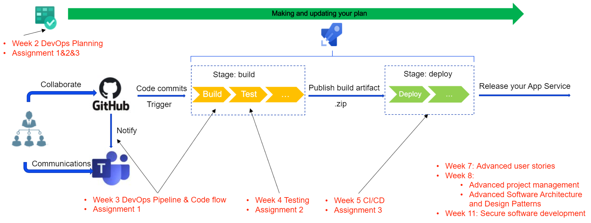

# 🛠️ **ASD - Advanced Software Development**

## 📚 **Overview**

Welcome to the **Advanced Software Development (ASD)** repository. This project encompasses a range of sophisticated topics and methodologies designed to elevate your software development skills to an industrial level. Below is an outline of the core areas covered:

### 1️⃣ **DevOps Pipeline**

- *Implementation and management of robust DevOps pipelines.*

### 2️⃣ **Industrial-Level Tools - Azure DevOps Services**

- *Utilizing Azure DevOps Services for efficient project management, CI/CD pipelines, and collaborative development.*

### 3️⃣ **Agile Methodologies**

- *Applying advanced Agile methodologies to enhance team collaboration and project efficiency.*

### 4️⃣ **Advanced Concepts and Methodologies in Software Development**

#### 🔹 **4.1. Advanced User Stories**

- *Crafting and managing complex user stories to meet intricate project requirements.*

#### 🔹 **4.2. Advanced Project Management**

- *Leveraging advanced project management techniques for successful project execution and delivery.*

#### 🔹 **4.3. Advanced Software Architecture and Design Patterns**

- *Exploring sophisticated software architecture principles and design patterns for scalable and maintainable systems.*

#### 🔹 **4.4. Secure Software Development**

- *Integrating security practices into every stage of the software development lifecycle to ensure robust and secure applications.*
